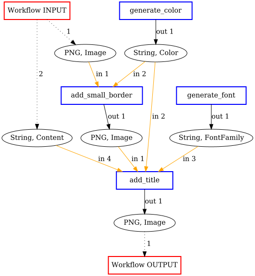
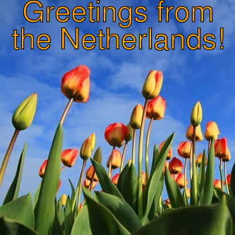
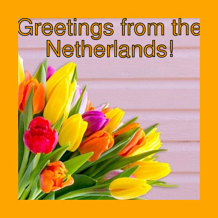

# ImageMagick: Postcard [Example 1]

In this example a postcard is generated by providing a APE with an `Image` and some `Content` as input. By setting the right constraint, we make sure the `Image` will get a border.

## Input / output

```json
{
	"inputs": [
		{ "Type": ["Image"], "Format": ["PNG"] },
		{ "Type": ["Content"] }
	],
	"outputs": [
		{ "Type": ["Image"], "Format": ["LosslessImageFormat"]  }
	]
}
```

## Constraints

1) At least one implemented tool of the abstract class `Borders` must be used in the solution workflow.

```json
{
  "constraints": [
    {
      "constraintid": "use_m",
      "parameters": [
        ["Borders"]
      ]
    }
  ]
}

```

## Generated Workflow
An example of a generated workflow:


## Generated script
An example of a generated shell scripts that corresponds to the workflow:
```bash
#!/bin/bash
if [ $# -ne 2 ]
	then
		echo "2 argument(s) expected."
		exit
fi
node579867570=$1
node1548883689=$2

# [generate_color]
read -p "Enter Color [default:Cyan]: " node173380607
node173380607=${node173380607:-Cyan}

# [generate_font]
read -p "Enter FontFamily name [default:Helvetica]: " node1695080704
node1695080704=${node1695080704:-Helvetica}

# [add_title]
node579870453='node579870453.png'
node579867570_height=$(($(identify -format '%h' $node579867570)/8))
convert $node579867570 -fill $node173380607 -stroke black -font $node1695080704 -pointsize $node579867570_height -gravity north -annotate 0 "$node1548883689" $node579870453

# [add_large_border]
node579871414='node579871414.png'
node579870453_height=$(($(identify -format '%h' $node579870453)/10))
convert $node579870453 -bordercolor $node173380607 -border $node579870453_height $node579871414

echo "1. output is: $node579871414"
```

## Executing the script

In order to be able to run the executable shell scipts of the demo examples, [ImageMagic](https://imagemagick.org/index.php) tools needs to be installed.

An example of a workflow execution:
```bash
> bash workflowSolution_0.sh input.png "Greetings from the\nNetherlands!"

Enter Color [default:Cyan]: Orange
Enter FontFamily name [default:Helvetica]:
1. output is: node579871414.png
```

#### INPUT (input.png):


#### OUTPUT (node579871414.png):
An image with an orrange border and text "Greetings from the Netherlands!"
<!---
#### `add_title` (node579870453.png)


#### `add_large_border` OUTPUT (node579871414.png):

--->
