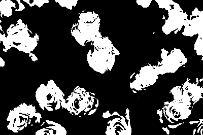
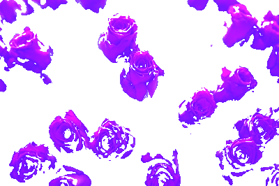

# ImageMagick: Replacing a color [Example 2]

In this example we will try to replace the `Color` red by the `Color` blue. Using our foreknowledge about images we assume there must be some kind of filtering involved, so we add the constraint to use a type `Filter` in the workflow solution.

After generating multiple workflows we notice that our provided `Colors` are all being used to add borders to our image, so we add a constraint to make sure that `Border` tools are not allowed in the workflow solution.

## Input / output

```json
{
	"inputs": [
		{ "Type": ["Image"], "Format": ["JPG"] },
		{ "Type": ["Color"], "Format": ["String"] },
		{ "Type": ["Color"], "Format": ["String"] }
	],
	"outputs": [
		{ "Type": ["Image"] }
	]
}
```

## Constraints

1) A filter data type needs to be used
2) Do not use an operation that draws borders
3) Cut operation needs to be followed by an operation that does image overlapping
```json
{
	"constraints": [
	   {
			"constraintid": "use_t",
			"parameters": [
				["Filter"]
			]
		},
		{
			"constraintid": "nuse_m",
			"parameters": [
				["Borders"]
			]
		},
		{
			"constraintid": "next_m",
			"parameters": [
				["cut"],
				["overlap"]
			]
		}
	]
}
```

## Generated Workflow
An example of a generated workflow:


## Generated script
An example of a generated shell scripts that corresponds to the workflow (where node[number] are auto generated variables):

```bash
#!/bin/bash
if [ $# -ne 3 ]
	then
		echo "3 argument(s) expected."
		exit
fi
node539597562=$1
node173381567=$2
node173381566=$3

node19521642='node19521642.png'
convert $node539597562 -fuzz 35% -fill black +opaque $node173381566 +fuzz -fill white +opaque black $node19521642

node579869492='node579869492.png'
convert $node539597562 +level-colors $node173381567, $node579869492

node579870453='node579870453.png'
convert $node579869492 $node19521642 -compose multiply -composite -transparent black $node579870453

node579871414='node579871414.png'
convert $node539597562 $node579870453 -background none -layers flatten $node579871414

echo "1. output is: $node579871414"
```

## Executing the script

In order to be able to run the executable shell scipts of the demo examples, [ImageMagic](https://imagemagick.org/index.php) tools needs to be installed.

An example of a workflow execution:
```bash
> bash workflowSolution_1.sh input.jpg "Blue" "Red"

1. output is: node579871414.png
```

#### INPUT (input.jpg):


#### INPUT (node579871414.png)
An image where the Red color was swapped with Blue.
<!---
#### `color_filter` (node19521642.png)
[//]: <>

#### `level_colors` (node579869492.png)


#### `cut` (node579870453.png)


#### `overlap` (node579871414.png):

--->
