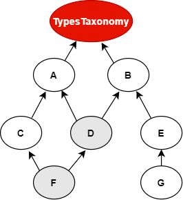

# Automated Pipeline Explorer Tutorial

This is a project used to demonstrate the sysnthesis functionality provided by APE (the Automated Pipeline Explorer) in an easy and understandable way.

The use case aims to demonstrate the usefulness of the synthesis approach for solving a workflow discovery problem with ImageMagick, an open-source software suite for displaying, creating, converting and modifying images.

For more info on installation see [APE](https://github.com/sanctuuary/APE).

## Domain Ontology
Domain ontology consists of taxonomic classificationsof the data types and operations in the application domain, and provides a con-trolled  vocabulary  that  allows  for  different  abstraction  levels  of  its  elements. APE loads the [domain ontology](imagemagick_taxonomy.owl) from a file in Web Ontology Language (OWL) format. Note that the the annotated tools are included in the image below (see Tool Annotations below) as blue leafs, although they are not part in the OWL file.


## Tool Annotation
Tool annotation is a collection of tools that have been semantically annotated, according to their inputs and outputs, based on the terms from the ontology. Here is an example for the annotated tool `compress`, which takes as input an Image (TypesTaxonomy) of any format (FormatsTaxonomy) and outputs an Image in the JPG format.

```json
{
        "label": "compress",
        "id": "compress",
        "taxonomyOperations": ["Conversion"],
        "inputs": [
          { "TypesTaxonomy": ["Image"] }
        ],
        "outputs": [
          { "TypesTaxonomy": ["Image"], "FormatsTaxonomy": ["JPG"] }
        ],
        "implementation": { 
           "code": "@output[0]='@output[0].jpg'\n
                    convert $@input[0] $@output[0]\n" 
           }
}
```

### Referencing the Domain Ontology
The the example above, the tool annotation references the abstract class `Conversion` from our domain ontology by specifying the `taxonomyOperations` tag.
A reference to a class (or a set of classes) in the domain ontology must be in array format. This array represents a conjunction of classes from the ontology. For example, given the ontology below. Specifying `["A", "B"]` as input for your tool makes sure only inputs of type `D` and `F` are allowed.



### Tool Implementation
The code specified in the tool annotation could be used to constuct a script that executes the workflow.
APE keeps track of the naming of the in- and output variables from tools. `@output[0]` references to the variable name of the first input type specified in the `"inputs"` tag.

For example, implementing this piece of code for a tool called `add`:
```json
"implementation": {
   "code": "@output[0] = $@input[0] + $@input[1]"
   }
```
could result in the script:
```text
node003 = $node001 + $node002
```

### Examples
- Postcard ([Example 1](/Example1))
- Repacing a color ([Example 2](/Example2))
