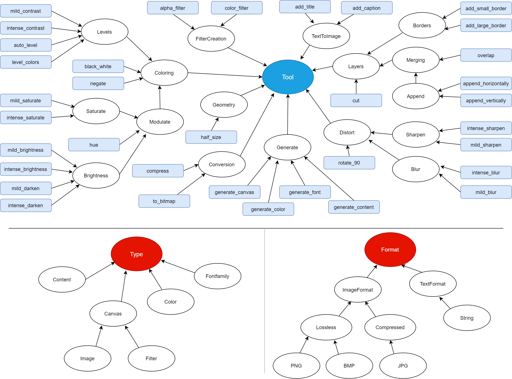

# Automated Pipeline Explorer Tutorial

This is a project used to demonstrate the sysnthesis functionality provided by APE (the Automated Pipeline Explorer) in an easy and understandable way.

The use case aims to demonstrate the usefulness of the synthesis approach for solving a workflow discovery problem with ImageMagick, an open-source software suite for displaying, creating, converting and modifying images.

## Installation
In order to run the synthesis, APE-&lt;version>.jar needs to be available: https://github.com/sanctuuary/APE. Furthermore, in order to be able to execute the generated workflows on the machine, the tools have to be annotated accordingly, and the corresponding software should be available.

### Download
This this stand-alone library includes all dependencies.
- [APE-1.0.0.jar](https://github.com/sanctuuary/APE_UseCases/raw/imagemagick/APE-1.0.0.jar) (25-05-2020)

### Build from source
[Maven 3.x.x+](https://maven.apache.org/download.cgi) and [Java 8](https://www.oracle.com/java/technologies/javase-jdk8-downloads.html) are required to build the project from source code.
Clone or download the project from https://github.com/sanctuuary/APE and run the following command from the project root:
```shell
> mvn package
```
This will build two JAR's to the ```target``` folder:
- ```APE-<version>.jar```
- ```APE-<version>-jar-with-dependencies.jar``` (this stand-alone library includes all dependencies)

### Maven
To include APE in a Maven project, add the following dependency to the POM file:
```xml
<dependency>
   <groupId>nl.uu.cs</groupId>
   <artifactId>ape</artifactId>
   <version>1.0.0</version>
</dependency>
```

## Run from CLI
In order to execute the synthesis it would be sufficient to provide the APE-&lt;version>.jar in the main .APE_UseCases directory and run the following command:
```shell
> java -jar APE-<version>.jar configuration.json
```

## Taxonomy


## Configuration
|Tag                        |Description                                                                                                                                                                                          |Default|
|---------------------------|-----------------------------------------------------------------------------------------------------------------------------------------------------------------------------------------------------|-------|
|ontology_path              |path to the taxonomy file  (provided demo example taxonomy.owl)                                                                                                                                      |       |
|toolsTaxonomyRoot          |name of the root tool class                                                                                                                                                                          |       |
|dataTaxonomyRoot           |name of the root data taxonomy class                                                                                                                                                                 |       |
|dataSubTaxonomyRoot[]      |list of sub roots within the data taxonomy, each sub root represents data dimension (e.g. data format, data type, etc.)                                                                              |       |
|tool_annotations_path      |path to the JSON file that contains basic tool annotation (provided demo example tool_annotations.json)                                                                                              |       |
|constraints_path           |path to the JSON file containing constraints representing workflow specification (optional)                                                                                                          |       |
|shared_memory              |true in a case of shared, memory structure, false if the message passing structure should be used                                                                                                    |       |
|solutions_path             |path to the file where the workflow solutions will be written                                                                                                                                        |       |
|solution_min_length        |minimum length from which solutions should be searched                                                                                                                                               |1      |
|solution_max_length        |maximum length to which solutions should be searched, put 0 in case of no limit                                                                                                                      |       |
|max_solutions              |max number of solutions that would be returned                                                                                                                                                       |       |
|execution_scripts_folder   |folder where the executable scripts will be generated                                                                                                                                                |       |
|number_of_execution_scripts|number of executable scripts that will be generated                                                                                                                                                  |       |
|solution_graphs_folder     |folder where the graphical representation of the workflows will be generated                                                                                                                         |       |
|number_of_generated_graphs |number of workflow figures that will be generated                                                                                                                                                    |       |
|inputs []                  |each input represent a single instance that will be an input to the program                                                                                                                          |       |
|inputs[]/{}                |each of the inputs can be described using the terms from data taxonomy, the tags used (in our example "TypesTaxonomy" reflects the corresponding taxonomy sub root                                   |       |
|outputs	[]                 |each output represent a single instance that will be an output of the program                                                                                                                        |       |
|outputs[]/{}               |each of the inputs can be described using the terms from data taxonomy, the tags used (in our example "TypesTaxonomy" reflects the corresponding taxonomy sub root                                   |       |
|debug_mode                 |true for debug command line output                                                                                                                                                                   |FALSE  |
|use_workflow_input         |ALL' if all the workflow inputs have to be used, 'ONE' if one of the workflow inputs should be used or 'NONE' if none of the workflow inputs has to be used (default value is ALL)                   |ALL    |
|use_all_generated_data     |ALL' if all the generated data has to be used, 'ONE' if one of the data instances that are generated as output, per tool, has to be used or 'NONE' if none of the data instances is obligatory to use|ONE    |

